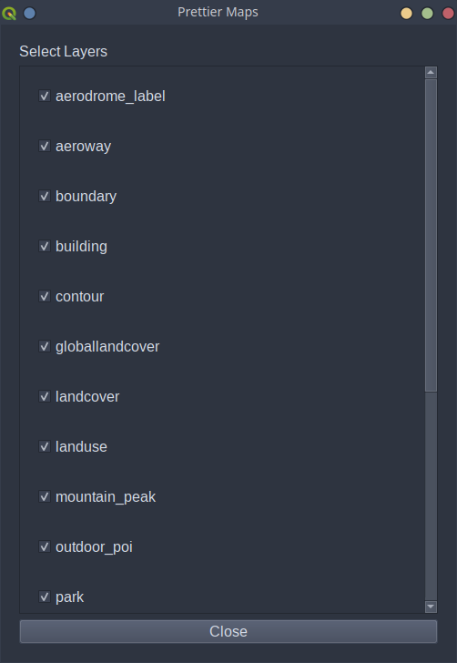

# Welcome to Prettier Maps

Prettier Maps helps makes working in QGIS easier.

### Description

PrettierMaps is a QGIS plugin that allows users further ease in creating and working with stylised maps. It works in tandem with MapTiler and QuickOSM (also QGIS plugins) and allows for easier management of MapTiler layers, and styling and saving of QuickOSM queries.

### Dependencies

The only dependency is MapTiler. However to make full use of the plugin, it is recommended to use the plugin in conjunction with MapTiler and QuickOSM.

### Installation

To install the plugin, install directly from the QGIS plugins page. Alternatively, download the zip file from the [releases](https://github.com/PrettierMaps/PrettierMaps/releases) page and install it in QGIS.

### Usage

To use the plugin, open a `Vector` map from MapTiler and then open the PrettierMaps plugin. There you will see a list of layers that you can enable/disable.

  <figure>
    
    <figcaption>Figure 1: Example UI of PrettierMaps plugin v1.3.0</figcaption>
  </figure>

To style or save a QuickOSM query, create a QuickOSM query using the QuickOSM plugin, then open the PrettierMaps plugin. You can now style this query by clicking the `Style QuickOSM Layer` button, and save by clicking `Save QuickOSM Layers`