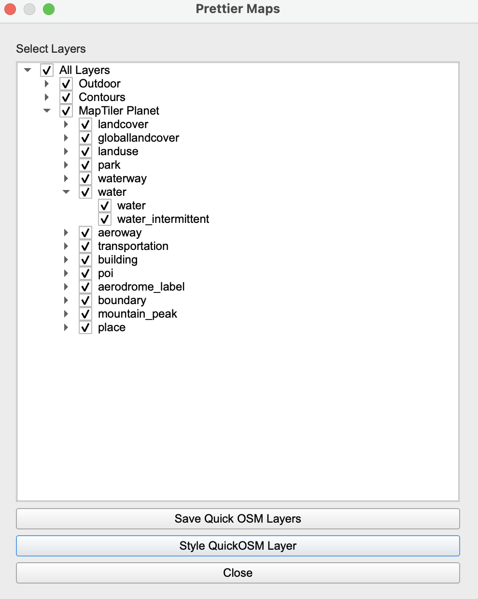

<h1 align="center">Prettier Maps 1.4.2</h1>

<p align="center">
  
</p>
<p align="center">
    <em>Style and work with maps easily in QGIS</em>
</p>

---

**Documentation**: <a href="https://prettiermaps.github.io/PrettierMaps/" target="_blank">prettiermaps.github.io/PrettierMaps</a>

**Issues**: <a href="https://github.com/PrettierMaps/PrettierMaps/issues" target="_blank">github.com/PrettierMaps/PrettierMaps/issues</a>

**Plugin**: <a href="https://plugins.qgis.org/plugins/prettier_maps/#plugin-details" target="_blank">plugins.qgis.org/plugins/prettier_maps/#plugin-details</a>

---

PrettierMaps is a QGIS plugin that allows users further ease in creating and working with stylised maps. It works in tandem with MapTiler and QuickOSM (also QGIS plugins) and allows for easier management of MapTiler layers, and styling and saving of QuickOSM queries.

---

## Using PrettierMaps

Make sure you have the QGIS application installed

The only dependency is MapTiler. However to make full use of the plugin, it is recommended to use the plugin in conjunction with MapTiler and QuickOSM.

#### Locally

1. Install the plugin dependencies to your QGIS Python environment:

```bash
pip install -e .[dev,test,docs]
```

2. Create the QGIS zip file:

```bash
make zip_plugin
```

#### In QGIS

1. Install the plugin from the QGIS plugin manager
2. Install the MapTiler and QuickOSM plugins from the QGIS plugin manager
3. Run the plugin from the QGIS plugin manager

### Usage

To use the plugin, open a `Vector` map from MapTiler and then open the PrettierMaps plugin. There you will see a list of layers that you can enable/disable.

<figure align="center">
  
  <figcaption>Figure 1: Example UI of PrettierMaps plugin v1.4.2</figcaption>
</figure>

To style or save a QuickOSM query, create a QuickOSM query using the QuickOSM plugin, then open the PrettierMaps plugin. You can now style this query by clicking the `Style QuickOSM Layer` button, and save by clicking `Save QuickOSM Layers`

## Maintaining

This project was a 3rd year University project at the University of Glasgow.
As we have now finished the project, this repository is no longer regularly maintained.

If you are interested in maintaining the project, please get in touch.

For now, [Matthew McKee](https://github.com/MatthewMckee4) is the maintainer.

## License
This project is licensed under the terms of the [GNU General Public License v2.0](https://github.com/PrettierMaps/PrettierMaps/blob/main/LICENSE)