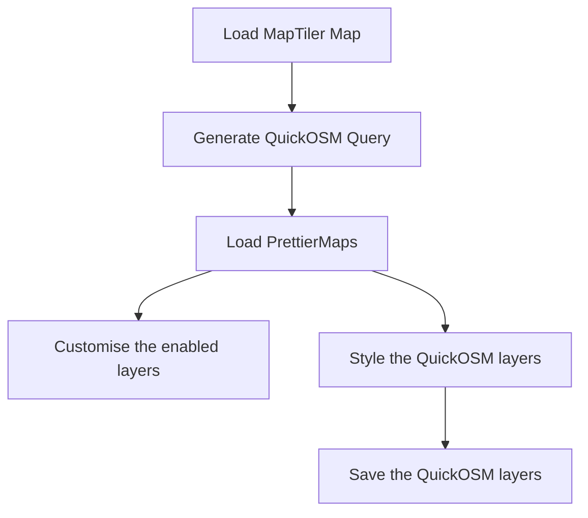

Here we outline the steps to create a stylised map using PrettierMaps.

```mermaid
flowchart TD
    B[Load MapTiler Map] --> C[Generate QuickOSM Query]
    C --> D[Load PrettierMaps]
    D --> E[Customise the enabled layers]
    D --> F[Style the QuickOSM layers]
    F --> G[Save the QuickOSM layers]
```